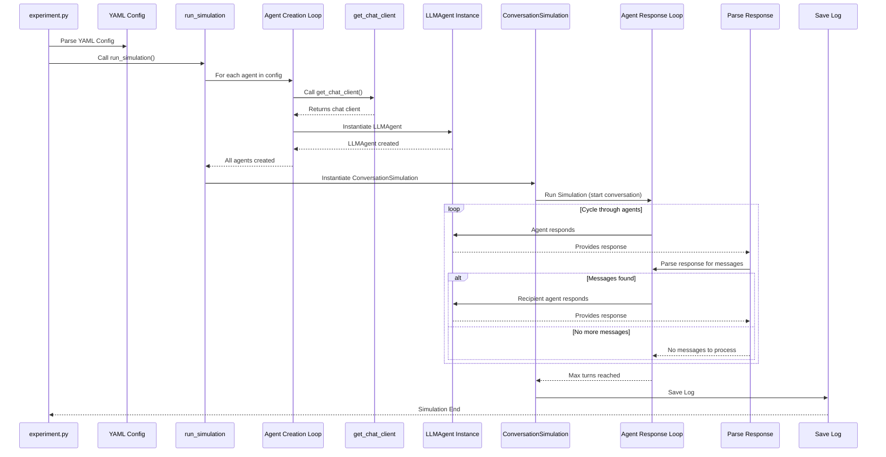

# Sequence Diagram

```mermaid
sequenceDiagram
    participant Experiment as experiment.py
    participant Config as YAML Config
    participant SimulationRunner as run_simulation
    participant AgentCreator as Agent Creation Loop
    participant ChatClient as get_chat_client
    participant LLMAgent as LLMAgent Instance
    participant ConversationSim as ConversationSimulation
    participant AgentInteraction as Agent Response Loop
    participant ResponseParser as Parse Response
    participant LogSaver as Save Log

    Experiment->>Config: Parse YAML Config
    Experiment->>SimulationRunner: Call run_simulation()
    SimulationRunner->>AgentCreator: For each agent in config
    AgentCreator->>ChatClient: Call get_chat_client()
    ChatClient-->>AgentCreator: Returns chat client
    AgentCreator->>LLMAgent: Instantiate LLMAgent
    LLMAgent-->>AgentCreator: LLMAgent created
    AgentCreator-->>SimulationRunner: All agents created
    SimulationRunner->>ConversationSim: Instantiate ConversationSimulation
    ConversationSim->>AgentInteraction: Run Simulation (start conversation)
    loop Cycle through agents
        AgentInteraction->>LLMAgent: Agent responds
        LLMAgent-->>ResponseParser: Provides response
        ResponseParser->>AgentInteraction: Parse response for messages
        alt Messages found
            AgentInteraction->>LLMAgent: Recipient agent responds
            LLMAgent-->>ResponseParser: Provides response
        else No more messages
            ResponseParser-->>AgentInteraction: No messages to process
        end
    end
    AgentInteraction-->>ConversationSim: Max turns reached
    ConversationSim->>LogSaver: Save Log
    LogSaver-->>Experiment: Simulation End
```
