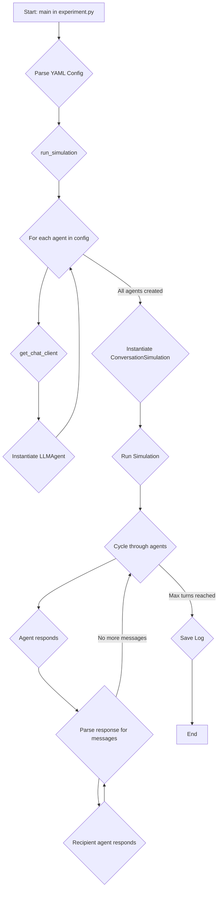

# Sequence Diagram

```mermaid
graph TD
    A[Start: main in experiment.py] --> B{Parse YAML Config};
    B --> C{run_simulation};
    C --> D{For each agent in config};
    D --> E{get_chat_client};
    E --> F{Instantiate LLMAgent};
    F --> D;
    D -- All agents created --> G{Instantiate ConversationSimulation};
    G --> H{Run Simulation};
    H --> I{Cycle through agents};
    I --> J{Agent responds};
    J --> K{Parse response for messages};
    K --> L{Recipient agent responds};
    L --> K;
    K -- No more messages --> I;
    I -- Max turns reached --> M{Save Log};
    M --> N[End];
```
